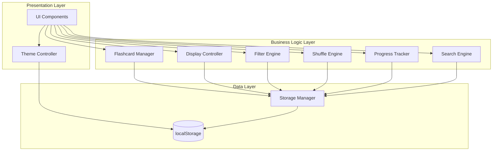

# Design Document: Japanese Vocabulary Flashcard Application

## Overview

The Japanese Vocabulary Flashcard Application is a client-side web application designed to help users learn Japanese vocabulary from the IRADORI textbook series. The application provides an interactive flashcard system with features for creating, managing, studying, and tracking progress across multiple textbook sources and chapters.

### Core Capabilities

- **Flashcard Management**: Create, read, update, and delete flashcards with comprehensive Japanese vocabulary data
- **Multi-Chapter Support**: Flashcards can appear in multiple chapters with intelligent deduplication based on view context
- **Interactive Study Modes**: Flashcard flipping and self-testing with answer input
- **Progress Tracking**: Track learning progress using unique vocabulary identifiers (Hiragana/Katakana or Kanji)
- **Filtering and Search**: Filter by script type (Hiragana-only vs Kanji-containing) and search across all fields
- **Theme Support**: Light and dark mode with persistent user preference
- **Responsive Design**: Mobile-first design using Tailwind CSS

### Key Design Principles

1. **Deduplication by Context**: Flashcards appearing in multiple chapters are deduplicated differently based on view scope (per-chapter, per-source, or all-sources)
2. **Unique Identifier Strategy**: Progress tracking uses Hiragana/Katakana or Kanji field values as unique identifiers to avoid duplicate counting
3. **Memory Status Per Instance**: Each flashcard instance maintains its own memory status, not shared across duplicates
4. **Client-Side Persistence**: All data stored in localStorage for offline capability
5. **Component-Based Architecture**: Modular design with clear separation of concerns

## Architecture

### High-Level Architecture

The application follows a component-based architecture with clear separation between data management, business logic, and presentation layers.



### Component Responsibilities

#### Flashcard Manager
- CRUD operations for flashcards
- Data validation and sanitization
- Multi-chapter assignment management
- Memory status updates

#### Display Controller
- Flashcard rendering (front and back sides)
- Flip animation coordination
- Context-aware deduplication logic
- Navigation between flashcards

#### Filter Engine
- Script type filtering (Hiragana-only vs Kanji-containing)
- Filter state management
- Filtered result computation

#### Shuffle Engine
- Randomization algorithm implementation
- Shuffle state persistence during session
- Re-shuffle capability

#### Progress Tracker
- Unique vocabulary counting using identifier fields
- Remembered vocabulary calculation
- Per-chapter, per-source, and all-sources statistics
- Deduplication logic for progress metrics

#### Search Engine
- Multi-field search across Kanji, Hiragana/Katakana, Meaning, and Romaji
- Case-insensitive matching
- Real-time search result updates

#### Theme Controller
- Light/dark mode toggle
- Theme preference persistence
- CSS class management for theme application

#### Storage Manager
- localStorage abstraction layer
- Data serialization/deserialization
- Error handling for storage operations
- Data migration support

## Components and Interfaces

### Flashcard Manager Interface

```javascript
class FlashcardManager {
  /**
   * Create a new flashcard
   * @param {FlashcardData} data - Flashcard data
   * @returns {string} - Unique flashcard ID
   */
  createFlashcard(data)
  
  /**
   * Update an existing flashcard
   * @param {string} id - Flashcard ID
   * @param {FlashcardData} data - Updated flashcard data
   * @returns {boolean} - Success status
   */
  updateFlashcard(id, data)
  
  /**
   * Delete a flashcard
   * @param {string} id - Flashcard ID
   * @returns {boolean} - Success status
   */
  deleteFlashcard(id)
  
  /**
   * Get flashcard by ID
   * @param {string} id - Flashcard ID
   * @returns {Flashcard|null} - Flashcard object or null
   */
  getFlashcard(id)
  
  /**
   * Get all flashcards
   * @returns {Flashcard[]} - Array of all flashcards
   */
  getAllFlashcards()
  
  /**
   * Update memory status for a flashcard
   * @param {string} id - Flashcard ID
   * @param {boolean} remembered - Memory status
   * @returns {boolean} - Success status
   */
  updateMemoryStatus(id, remembered)
}
```

### Display Controller Interface

```javascript
class DisplayController {
  /**
   * Display flashcards for a specific chapter within a source
   * @param {string} source - Source name
   * @param {number} chapter - Chapter number
   * @returns {Flashcard[]} - Flashcards for that chapter (no deduplication)
   */
  getFlashcardsForChapter(source, chapter)
  
  /**
   * Display flashcards for all chapters across all sources (deduplicated)
   * @returns {Flashcard[]} - Deduplicated flashcards
   */
  getFlashcardsForAllSources()
  
  /**
   * Render flashcard front side
   * @param {Flashcard} flashcard - Flashcard to render
   * @param {ViewContext} context - View context (chapter, source, or all)
   * @returns {HTMLElement} - Rendered front side
   */
  renderFront(flashcard, context)
  
  /**
   * Render flashcard back side
   * @param {Flashcard} flashcard - Flashcard to render
   * @param {ViewContext} context - View context (chapter, source, or all)
   * @returns {HTMLElement} - Rendered back side
   */
  renderBack(flashcard, context)
  
  /**
   * Handle flip interaction
   * @param {HTMLElement} flashcardElement - Flashcard DOM element
   */
  handleFlip(flashcardElement)
}
```

### Filter Engine Interface

```javascript
class FilterEngine {
  /**
   * Filter flashcards by script type
   * @param {Flashcard[]} flashcards - Flashcards to filter
   * @param {string} scriptType - 'hiragana' | 'kanji' | 'all'
   * @returns {Flashcard[]} - Filtered flashcards
   */
  filterByScriptType(flashcards, scriptType)
  
  /**
   * Get current filter state
   * @returns {string} - Current filter type
   */
  getCurrentFilter()
  
  /**
   * Set filter state
   * @param {string} scriptType - Filter type to set
   */
  setFilter(scriptType)
}
```

### Shuffle Engine Interface

```javascript
class ShuffleEngine {
  /**
   * Shuffle an array of flashcards
   * @param {Flashcard[]} flashcards - Flashcards to shuffle
   * @returns {Flashcard[]} - Shuffled flashcards
   */
  shuffle(flashcards)
  
  /**
   * Get current shuffle state
   * @returns {boolean} - Whether shuffle is active
   */
  isShuffled()
  
  /**
   * Reset shuffle state
   */
  resetShuffle()
}
```

### Progress Tracker Interface

```javascript
class ProgressTracker {
  /**
   * Calculate progress for Hiragana/Katakana vocabulary
   * @param {ViewContext} context - View context (chapter, source, or all)
   * @returns {ProgressStats} - Total and remembered counts
   */
  getHiraganaProgress(context)
  
  /**
   * Calculate progress for Kanji vocabulary
   * @param {ViewContext} context - View context (chapter, source, or all)
   * @returns {ProgressStats} - Total and remembered counts
   */
  getKanjiProgress(context)
  
  /**
   * Get unique vocabulary identifiers
   * @param {Flashcard[]} flashcards - Flashcards to analyze
   * @param {string} fieldName - Field to use as identifier ('hiragana' or 'kanji')
   * @returns {Set<string>} - Set of unique identifiers
   */
  getUniqueIdentifiers(flashcards, fieldName)
}
```

### Search Engine Interface

```javascript
class SearchEngine {
  /**
   * Search flashcards across multiple fields
   * @param {string} query - Search query
   * @returns {Flashcard[]} - Matching flashcards
   */
  search(query)
  
  /**
   * Check if a flashcard matches the query
   * @param {Flashcard} flashcard - Flashcard to check
   * @param {string} query - Search query
   * @returns {boolean} - Whether flashcard matches
   */
  matches(flashcard, query)
}
```

### Theme Controller Interface

```javascript
class ThemeController {
  /**
   * Toggle between light and dark mode
   */
  toggleTheme()
  
  /**
   * Get current theme
   * @returns {string} - 'light' | 'dark'
   */
  getCurrentTheme()
  
  /**
   * Set theme
   * @param {string} theme - 'light' | 'dark'
   */
  setTheme(theme)
  
  /**
   * Load theme preference from storage
   */
  loadThemePreference()
  
  /**
   * Save theme preference to storage
   */
  saveThemePreference()
}
```

### Storage Manager Interface

```javascript
class StorageManager {
  /**
   * Save flashcards to localStorage
   * @param {Flashcard[]} flashcards - Flashcards to save
   * @returns {boolean} - Success status
   */
  saveFlashcards(flashcards)
  
  /**
   * Load flashcards from localStorage
   * @returns {Flashcard[]} - Loaded flashcards
   */
  loadFlashcards()
  
  /**
   * Save theme preference
   * @param {string} theme - Theme preference
   */
  saveTheme(theme)
  
  /**
   * Load theme preference
   * @returns {string} - Theme preference
   */
  loadTheme()
  
  /**
   * Clear all data
   */
  clearAll()
}
```

## Data Models

### Flashcard Data Model

```javascript
/**
 * Flashcard represents a single vocabulary item
 */
class Flashcard {
  constructor() {
    this.id = '';              // Unique identifier (UUID)
    this.kanji = '';           // Kanji characters (can be empty for Hiragana-only words)
    this.hiragana = '';        // Hiragana/Katakana reading (required, used as unique identifier)
    this.meaning = '';         // English meaning (required)
    this.romaji = '';          // Romanized pronunciation (required)
    this.source = '';          // Source textbook (required, one of three IRADORI levels)
    this.chapters = [];        // Array of chapter numbers where this flashcard appears
    this.memoryStatus = false; // Boolean: true = remembered, false = not remembered yet
    this.createdAt = null;     // Timestamp of creation
    this.updatedAt = null;     // Timestamp of last update
  }
}

/**
 * FlashcardData represents the input data for creating/updating flashcards
 */
const FlashcardData = {
  kanji: '',           // Optional
  hiragana: '',        // Required
  meaning: '',         // Required
  romaji: '',          // Required
  source: '',          // Required: 'IRADORI Beginner Level (A1)' | 'IRADORI Basic Level 1 (A1)' | 'IRADORI Basic Level 1 (A2)'
  chapters: []         // Required: Array of chapter numbers
};
```

### View Context Model

```javascript
/**
 * ViewContext defines the scope for displaying flashcards
 */
const ViewContext = {
  type: '',      // 'chapter' | 'source' | 'all'
  source: '',    // Source name (for chapter and source contexts)
  chapter: null  // Chapter number (for chapter context only)
};
```

### Progress Stats Model

```javascript
/**
 * ProgressStats represents vocabulary learning progress
 */
const ProgressStats = {
  total: 0,       // Total unique vocabulary count
  remembered: 0,  // Remembered unique vocabulary count
  percentage: 0   // Percentage of remembered vocabulary
};
```

### Storage Schema

The application uses localStorage with the following keys:

```javascript
const STORAGE_KEYS = {
  FLASHCARDS: 'japanese-flashcards',  // Array of Flashcard objects
  THEME: 'japanese-flashcards-theme'  // String: 'light' | 'dark'
};
```

### Deduplication Strategy

Flashcards are deduplicated based on view context:

1. **Per-Chapter View** (Requirement 15, 16):
   - No deduplication
   - Show flashcard for each chapter it appears in
   - Chapter field shows only the current chapter number

2. **Per-Source View**:
   - No deduplication within source
   - Show flashcard for each chapter within that source
   - Chapter field shows only the current chapter number

3. **All-Sources View** (Requirement 17, 18):
   - Deduplicate by Hiragana/Katakana field value
   - Show flashcard only once across all sources
   - Chapter field shows all chapter numbers where it appears

```javascript
/**
 * Deduplication logic for all-sources view
 */
function deduplicateFlashcards(flashcards) {
  const uniqueMap = new Map();
  
  for (const flashcard of flashcards) {
    const key = flashcard.hiragana; // Use Hiragana/Katakana as unique identifier
    
    if (!uniqueMap.has(key)) {
      uniqueMap.set(key, flashcard);
    } else {
      // Merge chapters from duplicate flashcards
      const existing = uniqueMap.get(key);
      existing.chapters = [...new Set([...existing.chapters, ...flashcard.chapters])].sort((a, b) => a - b);
    }
  }
  
  return Array.from(uniqueMap.values());
}
```

### Progress Tracking Algorithm

Progress tracking uses unique identifiers to avoid duplicate counting:

```javascript
/**
 * Calculate unique vocabulary progress
 */
function calculateProgress(flashcards, identifierField) {
  const uniqueVocab = new Set();
  const rememberedVocab = new Set();
  
  for (const flashcard of flashcards) {
    const identifier = flashcard[identifierField];
    
    // Skip empty identifiers (e.g., empty Kanji field for Hiragana-only words)
    if (!identifier || identifier.trim() === '') {
      continue;
    }
    
    uniqueVocab.add(identifier);
    
    if (flashcard.memoryStatus === true) {
      rememberedVocab.add(identifier);
    }
  }
  
  return {
    total: uniqueVocab.size,
    remembered: rememberedVocab.size,
    percentage: uniqueVocab.size > 0 ? (rememberedVocab.size / uniqueVocab.size) * 100 : 0
  };
}
```

## Error Handling

### Storage Error Handling

```javascript
class StorageError extends Error {
  constructor(message, operation) {
    super(message);
    this.name = 'StorageError';
    this.operation = operation;
  }
}

// Error handling strategy
try {
  storageManager.saveFlashcards(flashcards);
} catch (error) {
  if (error.name === 'QuotaExceededError') {
    // Handle storage quota exceeded
    showUserMessage('Storage limit reached. Please delete some flashcards.');
  } else {
    // Handle other storage errors
    showUserMessage('Failed to save flashcards. Please try again.');
    console.error('Storage error:', error);
  }
}
```

### Validation Error Handling

```javascript
class ValidationError extends Error {
  constructor(message, field) {
    super(message);
    this.name = 'ValidationError';
    this.field = field;
  }
}

// Validation strategy
function validateFlashcardData(data) {
  const errors = [];
  
  if (!data.hiragana || data.hiragana.trim() === '') {
    errors.push(new ValidationError('Hiragana/Katakana is required', 'hiragana'));
  }
  
  if (!data.meaning || data.meaning.trim() === '') {
    errors.push(new ValidationError('Meaning is required', 'meaning'));
  }
  
  if (!data.romaji || data.romaji.trim() === '') {
    errors.push(new ValidationError('Romaji is required', 'romaji'));
  }
  
  if (!data.source || !VALID_SOURCES.includes(data.source)) {
    errors.push(new ValidationError('Valid source is required', 'source'));
  }
  
  if (!Array.isArray(data.chapters) || data.chapters.length === 0) {
    errors.push(new ValidationError('At least one chapter is required', 'chapters'));
  }
  
  return errors;
}
```

### User-Facing Error Messages

- **Storage Quota Exceeded**: "Storage limit reached. Please delete some flashcards to free up space."
- **Invalid Input**: "Please fill in all required fields: Hiragana/Katakana, Meaning, Romaji, Source, and Chapter."
- **Flashcard Not Found**: "Flashcard not found. It may have been deleted."
- **Network Error** (future): "Unable to sync data. Changes will be saved locally."

## Testing Strategy

### Testing Approach

The Japanese Vocabulary Flashcard Application requires a comprehensive testing strategy that combines:

1. **Unit Tests**: Verify specific examples, edge cases, and error conditions for individual components
2. **Integration Tests**: Verify component interactions and data flow
3. **End-to-End Tests**: Verify complete user workflows
4. **Manual Testing**: Verify UI/UX, theme switching, and responsive design

### Property-Based Testing Assessment

**Property-based testing (PBT) is NOT appropriate for this application** because:

1. **UI-Heavy Application**: The majority of requirements involve UI rendering, user interactions, and visual feedback (Requirements 3, 12, 13, 14, 15, 16, 17, 18)
2. **Simple CRUD Operations**: Flashcard management is straightforward create/read/update/delete without complex transformation logic (Requirement 1)
3. **Configuration and Display Logic**: Most logic involves organizing and displaying data rather than transforming it (Requirements 4, 5, 6, 7)
4. **Client-Side Storage**: localStorage operations are simple key-value storage without complex data transformations

### Unit Testing Strategy

Unit tests should focus on:

#### Flashcard Manager
- Creating flashcards with valid data
- Updating flashcards preserves ID and timestamps
- Deleting flashcards removes them from storage
- Validation rejects invalid data (empty required fields, invalid source)
- Memory status updates correctly

#### Display Controller
- Deduplication logic for all-sources view
- Chapter filtering for per-chapter view
- Front side shows Kanji and Hiragana/Katakana
- Back side shows Meaning, Romaji, Source, and Chapter(s)
- Chapter field shows single chapter in per-chapter view
- Chapter field shows all chapters in all-sources view

#### Filter Engine
- Hiragana-only filter returns only flashcards with empty Kanji field
- Kanji filter returns only flashcards with non-empty Kanji field
- Clear filter returns all flashcards

#### Shuffle Engine
- Shuffle produces different order than original
- Shuffle maintains all flashcards (no loss)
- Re-shuffle produces new order

#### Progress Tracker
- Unique vocabulary counting using Hiragana/Katakana identifier
- Unique vocabulary counting using Kanji identifier
- Duplicate flashcards counted as one unique vocabulary
- Remembered count only includes flashcards with memoryStatus = true
- Empty Kanji fields excluded from Kanji progress
- Per-chapter, per-source, and all-sources contexts produce correct counts

#### Search Engine
- Search matches Kanji field
- Search matches Hiragana/Katakana field
- Search matches Meaning field
- Search matches Romaji field
- Search is case-insensitive
- Empty query returns all flashcards

#### Theme Controller
- Toggle switches between light and dark
- Theme preference persists to localStorage
- Theme preference loads on initialization

#### Storage Manager
- Save flashcards serializes to JSON
- Load flashcards deserializes from JSON
- Handle QuotaExceededError gracefully
- Handle corrupted data gracefully

### Integration Testing Strategy

Integration tests should verify:

1. **Flashcard Lifecycle**: Create → Display → Edit → Update → Delete
2. **Memory Status Flow**: Mark as remembered → Progress updates → Display reflects status
3. **Filter + Shuffle**: Apply filter → Shuffle → Verify filtered results are shuffled
4. **Search + Display**: Search → Display results → Flip flashcards
5. **Theme + Display**: Toggle theme → Verify all components reflect theme change

### End-to-End Testing Strategy

E2E tests should verify complete user workflows:

1. **Study Session**: Navigate to chapter → View flashcards → Flip cards → Mark as remembered → Check progress
2. **Guessing Game**: Navigate to chapter → Start guessing game → Type answer → Submit → Compare → Next card
3. **Flashcard Management**: Add flashcard → Assign to multiple chapters → View in different chapters → Edit → Delete
4. **Cross-Source Study**: View all-sources flashcards → Verify deduplication → Check chapter field shows all chapters
5. **Search Workflow**: Enter search query → View results → Clear search → View all flashcards

### Manual Testing Checklist

- [ ] Responsive design works on mobile, tablet, and desktop
- [ ] Light mode is visually comfortable
- [ ] Dark mode is visually comfortable
- [ ] Theme toggle is intuitive
- [ ] Flashcard flip animation is smooth
- [ ] Navigation is intuitive
- [ ] Form validation provides clear feedback
- [ ] Progress statistics are clearly displayed
- [ ] Footer displays copyright information
- [ ] All text is readable in both themes

### Test Data Strategy

Create test fixtures with:
- Flashcards with Kanji (e.g., "食べる")
- Flashcards without Kanji (e.g., "おはよう")
- Flashcards appearing in multiple chapters
- Flashcards from different sources
- Flashcards with various memory statuses
- Edge cases: very long text, special characters, numbers

### Testing Tools

- **Unit Tests**: Jest or Vitest
- **Integration Tests**: Jest or Vitest with DOM testing utilities
- **E2E Tests**: Playwright or Cypress
- **Code Coverage**: Aim for >80% coverage on business logic components

